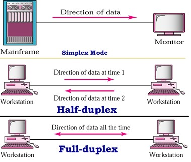
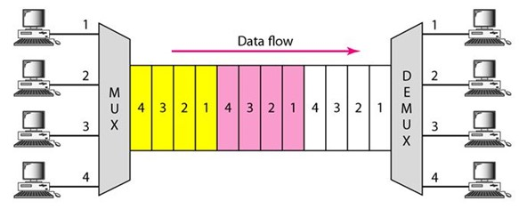

Önbellekleme(Cache) Teknolojileri ve RESP3 Protokol Destekli Yüksek
Performanslı .Net Standart Redis Client

-   **Cache(Önbellek) Nedir?**

Yazılım terimleri arasında çok sık kullandığımız “Cache” yani “Önbellek”
hayatımızın her noktasında kullandığımız ve sistemlerin çalışmasında
hayati önem taşıyan bir terimdir. Yazılım sektörü dışında da örneklerine
sık rastlayabileceğimiz konulardandır. Örneğin bir yemek yapımında ya da
bir tamirat işleminde kullanılması planlanan malzemelerin tezgâh
üzerinde hazır olarak bulundurulması da bir önbellek oluşturulması ile
aynı işlevi görür. Burada temel nokta şudur; her ne yapmak için hazır
olarak bulunduracağınız her ne ise kullanım noktasına en yakın yerde
bulundurulmalıdır. Yani yemek yapımı için hazırda bulundurmanız gereken
materyalleri yemeği yaptığınız tezgâh yerine kilerde ya da dolapta
hazırda bekletirseniz, size yemek yapımı sırasında yeterli kolaylığı ve
hızı kazandırmayacaktır.

Yazılım meslek hayatımızda bu mekanizmaları o kadar yoğun kullanıyoruz
ki kullandığımızı fark etmediğimiz birçok nokta olması muhtemeldir.
Örneğin sıradan bir metot içinde kullandığımız değişkenler, çalışma
zamanında metot içinde birden fazla kullanıldığı durumlar düşünülerek
RAM üzerine sürekli başvurmamak için işlemcinin belleğine alınırlar (L3
bölgesi). RAM erişim hızı bir http çağrısına kıyasla bizim hiç külfetini
dikkate almayacağımız kadar hızlı olsa bile işlemcinin işlem yapmak için
ihtiyacı olan her ne ise malzemelerini en yakın bölgesinde hazırda
bekletme eğiliminde tasarlandığını görürsünüz.

Ancak bazı durumlarda çoklu işlemlerin paylaştığı ortak veriler söz
konusu olduğunda en güncel verinin işlenmesi gerekebilir. Bu durumda her
ne kadar hız kaybı yaşanacak olsa da iş kuralı gereği önbellek
mekanizması devre dışı bırakılır. İşlemci örneğinde değişkenlerin
önbellek kullanımlarını engellemek için C\# dilinde değişkenler
tanımlarken **“volatile”** anahtar kelimesinin kullanılması yeterlidir.
Bu sayede her değişken erişiminde elde edilen veri RAM üzerinden
getirilir.

-   **İnternet Üzerinden Kullanılan Dış Servis Verileri ve Önbellekleme
    İşlemi**

Yazılımcılar olarak geliştirdiğimiz çoğu sistem internet üzerinden
birbirine bağlanmaktadır. İş kurallarımız gereği internet üzerindeki
birçok kaynaktan elde edilen veriler üzerinden işlemlerimizi yürütürüz.
Eğer bu veriler içinde kaynağında çok sık değişmeyenler varsa veya
değiştiği zaman anlık olarak güncel verinin kullanılması zorunlu
değilse, bu verileri ilk servis çağrısı sonrası RAM üzerine yazmak ve
bir sonraki ihtiyaçta RAM üzerinden kullanmak, veriyi tezgahımıza
yaklaştırmak olacaktır ve yeniden erişimimizde bize yüksek performans
kazanımı sağlayacaktır.

Bu noktaya kadar bahsettiğimiz önbellekleme işlemleri temel ve
halihazırda çok çaba sarf etmeden kullandığımız teknolojilerdir. Bu
noktadan sonraki ihtiyaç, aynı ortak veriye internet üzerindeki farklı
uygulamalardan erişmeye çalıştığımız noktada biraz daha karmaşıklaşmaya
başlıyor. Çünkü burada sistemimizde bir grup uygulama var ve hepsinin
aynı veri üzerinde çalışması gerekiyor. Bu da ortak bir noktadan eşit
güncel veri ile çalışmalarını garanti etmek demektir ve bu durumda her
uygulama doğrudan kendi lokal değişkenlerinde bu veriyi saklayamaz. Eğer
saklarlarsa diğer uygulamalarla birlikte aynı veriyi kullandığını
garanti edemezler.

Burada iki yöntemle ilerlenebilir;

-   Birincisi, en güncel veriye kaynağından erişmek,

-   İkincisi ise veriyi kaynağından alıp, uygulamalara kaynağından daha
    yakın ortak başka bir noktaya koyarak erişmek.

Eğer veri herhangi bir işlemden geçmiyor ve veri kaynağının yakınlığı
uygulamalar için kullanılabilir herhangi bir ortak nokta kadar yakınsa
doğrudan kaynağından erişmek mantıklı olabilir. Fakat okuma yazma hızı
verinin kaynağında işlem gerektiriyor ve yakınlık anlamında da yeterince
yakın değilse, veriyi konumlandırmamız gereken yakın bir nokta ve bu
noktanın da erişimde hızlı teknolojiler içermesi gerekiyor. Bu tip
sistemlere **“Dağıtık Önbellek Sistemleri(Distributed Cache Systems)”**
adı veriliyor. Örnek olarak Redis ya da Memcached uygulamaları bu tip
dağıtık önbellekleme sistemleri sunan ürünlerden bazılarıdır. Veri
saklama elde etme ve transfer protokollerinde yüksek performans
hedeflenerek tasarlanmışlardır.

-   **Ölçeklenebilir Sistemlerde Önbellekleme İşlemi**

Günümüzde internetin öneminin artması ile oluşan yoğun trafiği
karşılayabilmek adına, sunulan bir uygulamanın gerektiğinde şartlara
göre sayısının artırılabilmesi ya da içinde bulunduğu sunucunun
kaynaklarının artırılabilmesi gerekmektedir.

-   Sunucu kaynaklarının artırılması işlemine **“Dikey Öçeklendirme
    (Vertical Scaling)”** ,

-   Aynı sunucu kaynakları üzerinde uygulama sayısının artırılması ise
    **“Yatay Ölçeklendirme (Horizontal Scaling)”** adı veriliyor.

Yatayda ölçeklendirme ihtiyacı, uygulama sayılarını artırır ve
önbellekleme işlemlerinin birden fazla uygulamada yönetilmesi gerekir.
Bu durumda veri tutarlılığının önemli olmasından dolayı önbellek
işlemlerinin dağıtık önbellekleme sistemleri üzerinden yapılması
gerekebilir.

Dağıtık önbellekleme sistemleri hiçbir zaman işlemlerin
gerçekleştirildiği noktaya en yakın yöntem değildir. Bu yüzden bir
noktada performansın mutlaka yönetilmesi gerekir. Örneğin Redis sunucusu
üzerinde tutulan bir veriye ulaşmak veya o veriyi değiştirmek ağ
transferi üzerinden sağlandığı için bir döngüde binlerce kez bir veriye
erişim ihtiyacı duyulduğunda ağ bant genişliğini ciddi oranda
tüketecektir. Ancak diğer yönden de veriyi doğrudan her uygulama için
işlem bölgesine en yakın yerlerden biri olan RAM bölgesine yazmış
olsaydık her bir uygulama için verinin güncelliğini de garanti altına
almamız gerekirdi.

Bu problemler ışığında yatay ölçeklenebilir sistemlerde bazı **dağıtık
yakın hafıza önbellekleme (Distributed InMemory Cache)** çözümleri
üretilmiş ve kullanılmaktadır. En yaygın çözümde erişilmek istenen veri,
uygulamaların yakın hafızası (RAM) ve ortak bir noktadaki dağıtık
önbellek (Distributed Cache) noktalarında birlikte barındırılmaktadır.
Uygulamalar yakın hafızalarındaki verilerin güncelliğinin değiştiği
durumları öğrenmek için ayrıca bir mesaj kanalı dinlerler. İlgili
verileri dağıtık önbellek üzerinde güncelleyen başka uygulamalar ise bu
mesaj kanalına değişim mesajlarını bırakırlar. Değişim mesajlarını alan
uygulamalar yakın hafızalarındaki değişen verileri silerler ve ihtiyaç
duyduklarında tekrardan tek seferlik olarak ortak noktadaki dağıtık
önbellek üzerinden elde ederek tekrar kullanmak üzere yakın hafızalarına
kaydederler. Böylelikle uygulamalar sürekli ağ üzerindeki ortak noktaya
başvurarak bant genişliği tüketmek yerine, en son elde edildikten sonra
değişim mesajı gelmemiş yakın hafızalarına aldıkları veriyi kullanarak
veriye daha hızlı bir yöntemle ulaşmış olurlar. Değişim mesajları ile de
verinin güncelliğini sağlamış olurlar.

Bu yöntem bir problemi çözmeye çalışırken uyguladığı mekanizma ile bazı
problemleri de ortaya çıkartır. Bunlardan bazıları şunlardır:

-   Dağıtık nokta üzerinde önbelleğe alınan veriler genellikle bir
    geçerlilik süresi ile kayıt altına alınırlar (Time to Live.
    Bkz: TTL). Yakın hafızaya konumlandırılan veri elde edilirken bu
    süre gözetilmeden kayıt altına alınır. Eğer bu geçerlilik süresi
    içinde veriye ait bir değişim mesajı gönderilmemişse veri dağıtık
    önbellek noktasında silinmiş olabilir. Bu durumda uygulama yakın
    hafızasında bulunan verinin güncelliğini garanti edemez.

-   Bu sistem, yakın hafızaya alınmış verinin güncelliğinin bir mesaj
    kanalı üzerinden kontrol edilmesi üzerine kurulmuştur. Ortak
    noktadaki dağıtık önbellek üzerinde bu sistemle çalışmayan bir
    uygulama tarafından yapılan ya da insan eliyle yapılacak bir
    değişiklik, bu mesaj kanalı vasıtası ile değişim
    mesajları iletmeyecektir. Bu durumda uygulama yakın hafızasında
    bulunan verinin güncelliğini garanti edemez.

-   **LCWaikiki Teknoloji Dönüşüm Projelerinde Önbellekleme**

LCWaikiki uygulamalarında yatay ölçekleme yaptığımız yoğun noktalarda
önbellekleme için Redis uygulamasını tercih ediyoruz. Birkaç ay öncesine
kadar bazı noktalarda yukarıda bahsettiğim dağıtık yakın hafıza
önbellekleme tekniğini kullanıyorduk.

Haziran 2021 itibari ile LCWaikiki E-Ticaret ailesinde kullanılan
LocalizationService uygulamasını teknoloji dönüşümüne dahil ettik. Redis
bağlantısı için modernizasyonda kullanmak üzere daha önceki projelerde
de kullandığımız **Stackexchange.Redis** kütüphanesini tercih etmiştik.

Teknoloji dönüşüm projelerimiz devam ederken bireysel olarak bazı
transfer teknolojileri üzerinde de araştırma ve çalışmalarım vardı ve bu
teknolojileri sıfırdan geliştirdiğim bir Redis Client uygulaması
üzerinde uygulayarak denemeler yapıyordum. Bu çalışma ile Windows
tabanlı Redis Desktop Manager uygulaması benzeri Web tabanlı Redis Web
Manager uygulaması geliştirmeye çalışıyordum.

Dönüşüm mimarisini tasarlarken kişisel araştırmalarımdan esinlenerek
RESP3 protokolü ile gelen geçersizlik mekanizmasını (**Invalidate
Mechanism**) kullanmayı planladım. Dağıtık yakın hafıza
önbellekleme(**Distributed InMemory Cache**) sistemi için gerekli olan
bu mekanizma, Redis sunucusu versiyonlarından 6.0.0 versiyonu ve
sonrasında desteklenmektedir.

Bu sistemi tercih etme sebebim yukarıda bahsettiğim problemlerden
kaçınmak ve aynı zamanda aşağıdaki faydaları sağlayabilmekti:

-   RESP3 protokolü, RESP2 de ayrıca başka bir kanal gerektiren pub-sub
    mekanizmasını tek kanaldan yönetebiliyor. Bu da bağlantı sayılarını
    yarı yarıya düşürüyor.

-   RESP3 protokolünde istemcileri takip etme mekanizması
    **(client tracking)** hangi istemcinin en son hangi anahtar kelimeyi
    sorguladığını tutuyor. Hangi şekilde değişiklik gerçekleşirse
    gerçekleşsin, değişen ya da TTL süresi dolan anahtar kelimeyi sadece
    hangi istemciler kullanmışsa onlara protokolde geçen “PUSH” nesnesi
    olarak “geçersiz” mesajı iletiyor.

    -   Mesaj trafiği üssel derecede azalıyor.

    -   Diğer yöntemlerde pub-sub mesajları uygulama seviyesinde
        yönetilirken, bu yöntemde veri kaynağı olan sunucu her ne
        şekilde olsun değişimin ilgili istemcilere iletilmesini
        garanti ediyor.

    -   RESP3 dışındaki uygulama seviyesinde yönetilen geçersizlik
        mesajları TTL durum değişikliklerini iletmeyi garanti edemez.
        Aynı zamanda uygulama seviyesinde yönetilen geçersizlik
        mesajları içeren sistemlerde yönetimi yapmayan uygulamaların
        değiştirdiği anahtarların geçersizlik mesajları diğer
        uygulamalara iletilemeyecektir. Bu da veri tutarlılığını bozar.

**Stackexchange.Redis** kütüphanesi Redis sunucusunun iletimde
kullandığı RESP protokol versiyonlarından RESP1 ve RESP2 yi
destekliyorken RESP3 protokolünü desteklememektedir. Pandemi ve
teknolojik gelişmelerin desteklediği yüksek veri trafiğine ek olarak bir
de dönemsel kampanyaların getireceği yüksek veri trafiğini de ele
aldığımızda RESP3 teknolojisini mutlaka kullanmamız gerektiğini
düşündüm.

Halihazırda bireysel olarak denemelerimde kullandığım Redis bağlantı
sağlayıcısı mekanizmasını özelleştirerek paket haline getirip dönüşüm
projemizde kullanmak üzere direktörümüz Utku Tatlıdede ile görüştüm.
Kendisi de avantajlarını dikkate değer buldu ve dönüşüm projesinde
deneme konusuna sıcak baktı.

Kasım kampanyalarında Stackexchange.Redis kullanan yoğun yerler cevap
vermekte zorlanınca o noktaları RESP3 protokol destekli yeni
geliştirdiğim Redis bağlantı sağlayıcısı ile değiştirdik. Ve kasım
kampanyasını oldukça rahat bir şekilde geçirdik.

Sonuç olarak evrensel bir kütüphane geliştirmiş oldum ve LCWakiki
yönetimimizin desteği ile de ortaya çıkan ürünün yeteneklerini ispat
etmiş olduk. Kodlarına aşağıdaki github adresinden erişebilirsiniz.
Sizlerin de desteği ile kütüphanenin yeteneklerini daha da ileriye
taşıyarak teknolojiye el birliği ile katkıda bulunmuş olacağız.

[*https://github.com/orgs/TheUniversalCity/repositories*](https://github.com/orgs/TheUniversalCity/repositories)

-   **RESP3 Redis Bağlantı Sağlayıcısı Yapısı**

Redis veri transferini TCP/IP transfer protokolü üzerinden RESP uygulama
katmanı protokolü ile yapmaktadır. Redis’in veri transferi protokolü
olan RESP yapısını anlayabilmek için TCP/IP protokolü hakkında temel
bilgilerin gözden geçirilmesi gerekmektedir.

TCP/IP, iki cihaz arasında çift yönlü “byte” dizisi transferi yapan
iletim protokolüdür. Bir TCP bağlantısı sağlandığında fiziksel olarak
çift yönlü **(Full-Duplex)** bir bağlantı kanalı açılır. Bu bağlantı
üzerinde birbirinden bağımsız iki yönde de aynı anda veri iletimi
yapılabilir. Bu veri iletimi ile iki taraf birbiri ile haberleşmiş olur.

TCP tanımında taraflar “Aktif” ve “Pasif” olarak adlandırılırlar.

**Pasif Taraf:**

Bir bağlantının sağlanabilmesi için her zaman bir tarafın bağlantıyı
önceden açması gerekir. Bu görevi pasif taraf üstlenir. Karşısında bir
taraf beklemeden bir kapı **(Port)** açabilen pasif taraf, kapıyı
açtıktan sonra bağlantı taleplerini kabul etmeyi bekler. Bir pasif
taraf, açmış olduğu kapıdan fiziksel olarak aynı anda birden fazla aktif
taraf ile el sıkışabilir. Dinleyici rolü sebebiyle kendisine bağlantı
isteği atan aktif tarafın görevlerini bilmek zorunda değildir.

-   Aktif taraftan aldığı komut ve verilerle bir görev yerine getirerek
    yanıt döner.

-   Üstlendiği görevlere ilişkin herhangi bir komut ya da veri
    beklemeden doğrudan el sıkıştığı aktif tarafa veri
    iletimi sağlayabilir.

Bu özellikleri nedeni ile **“sunucu (Server)”** olarak bilinir. Redis
sunucusu kurduğu bağlantılarda pasif taraftır.

**Aktif Taraf:**

Aktif taraf her zaman konumunu bildiği bir pasif taraf ile el sıkışarak
bağlantıyı sağlamak zorundadır. Bir aktif taraf sadece bir pasif taraf
ile fiziksel olarak el sıkışabilir. İstemci rolü nedeni ile bağlantı
isteği attığı pasif tarafın üstlendiği görevleri bilir ve isteklerinin
karşılanmasını bekler. Bu nedenle **“istemci (Client)”** adı ile
bilinir. Redis sunucusuna bağlantı kuran istemciler kurdukları
bağlantıda aktif taraftırlar.

Bu aktif ve pasif taraflar TCP bağlantısı üzerinden iletilen verileri
anlamlandırmak ve karşılıklı haberleşebilmek için kendi aralarında bir
dil geliştirmeleri gerekir. TCP gibi çift taraflı (Duplex) transfer
protokollerinde fiziksel olarak aynı anda veri gönderilebilir ve
alınabilir. Böylelikle de istemci bir talepte bulunacağı veriyi
ilettiğinde sunucunun tekrar o isteğin cevabını ne zaman döneceği belli
değildir. Ve hangi cevabın hangi isteğin cevabı olduğunu bilmek gerekir.
Ayrıca alınan verinin ne kadarının bir cevap olduğunu da bilmek gerekir.
Tüm bu karmaşanın nasıl işleyeceğini belirleyen ve istekler ile
cevapların belirli bir düzende yönetilmesini sağlayan standart
kuralların tamamı uygulama seviyesinde bir üst protokol oluşturur.
**RESP (REdis Serialization Protocol)** de bu protokoller arasındadır.

-   **RESP (REdis Serialization Protocol)**

Redis bir sunucudur ve kendisine bağlanan istemcilerin ihtiyaçlarını bir
protokolün kuralları çerçevesinde karşılar. Bu protokol tanımına
**“REdis Serialization Protocol”** denilmektedir. “RESP” bu ifadenin
kısaltılmış halidir.

RESP en temelde Redis sunucusuna TCP ile bağlanan istemcilere benzersiz
bir numara atanmasını garanti eder. Bu şekilde istemcilerle iletişim
kurarken atanmış bir numarası bulunan istemcilerden gelen komutların
cevaplarının aynı sırada aynı numaradaki istemciye iletilmesini garanti
etmektedir. Bu tekniğe iletişim teknolojilerinde sıklıkla kullanılan
**“Çoğullama (Multiplexing)”** denilmektedir.

Fiziksel olarak tek kanaldan yapılan veri transferlerinde aynı anda bir
yönde yalnızca bir veri transferi yapılabilir. Bir çok farklı mesajın
birleştirildikten sonra transfer edilip arkada ayrıştırılması işlemine
**“çoğullama (Multiplexing)“** adı verilmektedir. Redis iletişiminde
çoğullama işlemini RESP kuralları sağlar. Redis iletiminde veriler
serileştirme kurallarına göre bütün halinde ve sıralı bir şekilde
iletilir. Cevapların da aynı sıra ile iletileceği garanti edilir.

Redis çoğullama yapısında sıra yönteminin kullanılmasındaki tek etmen
yüksek hızdır. Diğer bazı protokollerde mesajlara ait numaralandırma
yöntemleri kullanılarak bir mesajın parçaları mesaja ait numara üst
bilgisi ile karışık halde de iletilebilmektedir. Ancak bu yöntem,
mesajın parçalanması ve birleştirilmesi sırasında üst bilgilerin
yorumlanması gibi ek işlemler gerektirmektedir. Bu da performans kaybına
sebep olmaktadır. Redis performans kazanmak için bu üst bilgileri
kullanmadan veriyi bütünler halinde sıra ile gönderir ve gönderdiği
sıranın aldığı komut sırasında olduğunu garanti eder.

HTTP gibi bazı üst protokollerde iletilen verinin yorumlanması veya
cevapla ilişkilendirmeyi kolaylaştıracak bazı üstbilgi(metadata)
tanımları bulunur. Örneğin HTTP veri transferlerinde iletilen verinin
yapısını sunucunun tanıyabilmesi için “Content-Type” başlığı ile
içeriğin tipi de üst bilgi olarak eklenir. RESP iletimde yüksek hızı
hedeflediğinden iletim sırasında veri dışında hiçbir
üstbilgiyi(metadata) barındırmaz.

Aşağıdaki redis cevabını inceleyebilirsiniz:

\$11&lt;CR&gt;&lt;LF&gt;Gelen Cevap&lt;CR&gt;&lt;LF&gt;

Bu mesaj istemci tarafına cevap olarak iletilirken baştan başlayarak
sıra ile iletilir. İstemcinin bu cevabı çözebilmesi için verinin tipini
ve transferin nerede son bulacağını bilmesi gerekir. Bu yüzden RESP
tanımında ilk önce verinin tipi iletilir. Yukarıdaki “\$” harfi bu
verinin “Bulk String” olduğunu belirtir. “\$” ile “&lt;CR&gt;&lt;LF&gt;”
arasında gönderilen tüm rakamlar verinin boyutunun kaç bayt olacağını
belirtir. Yukarıda görünen 11 sayısı ilk “&lt;CR&gt;&lt;LF&gt;” ile son
“&lt;CR&gt;&lt;LF&gt;” arasında 11 bayt okuması gerektiğini bildirir.
Detaylı bilgiye aşağıdaki bağlantı üzerinden ulaşabilirsiniz.

[*https://redis.io/topics/protocol*](https://redis.io/topics/protocol)

Bu önden bilgilendirme yapısı ile veri transfer edilirken aynı zamanda
yorumlama işlemi de yapılabildiğinden oldukça verimli bir yöntemdir.

Redis komut işleme ve cevap göndermenin yanında bir mesaj kanalına
abonelik işlemini (PUB/SUB) de destekler. RESP1 ve RESP2 tanımlarında
bir istemci sunucuya belli bir mesaj kanalı için abone olduğunda komut
göndermeksizin sunucu üzerinden komut bekler. Bu nedenle sıralı
çoğullama özelliğini kaybedeceği için açılan kanalın protokolü PUSH
protokolüne dönüşmüş olur. Dolayısı ile komut gönderme ve cevap alma
yeteneğini kaybeder.

RESP3 tanımında ise çoğullama yeteneği eklenen yeni nesne türleri ile
genişletilmiştir. Sunucunun gönderdiği otomatik mesajları istemciye yeni
tanımla gelen PUSH nesnesi ile gönderildiği için gönderilen sıralı
komutlar için beklenen diğer objeler ayırt edilir ve sırası
karıştırılmadan iletişim devam eder. Bu sayede aynı istemci kanalı
üzerinden komut gönderilip cevapları alınırken aynı zamanda sunucu
tarafından gönderilen abonelik mesajları da istemci tarafından komut
cevapları ile karıştırılmadan elde edilmiş olur.

RESP3 tanımı PUSH bildirimlerini de barındırdığından dolayı istemci
tarafı önbellekleme (Client Cache) işlemlerini de destekler haline
gelmiştir. Çünkü RESP3 tanımında genişletilmiş PUSH bildirimleri
sayesinde istemciler, anahtara karşılık gelen değerleri sorguladığı
kanaldan aynı zamanda daha önce sorgulamış olduğu anahtarlardan geçersiz
hale gelenlerin bildirimlerini de alabilme yeteneği kazanmıştır.

Aşağıdaki komut sunucuya iletildiğinde;

**CLIENT TRACKING on**

Redis ilgili istemciyi **geçersizlik tablosuna (INVALIDATE TABLE)**
kaydeder. Bu tablo hangi anahtarın hangi istemci tarafından
sorgulandığını kayıt altında tutar. Eğer bu tabloda bulunan
anahtarlardan birisi geçersiz hale gelirse, yani silinir, güncellenir ya
da yaşam süresi son bulursa, geçersizlik tablosu üzerinde hangi
istemcinin bu anahtarı sorguladığını tespit edip bu istemcilere
aşağıdaki gibi bir **“Geçersizlik Bildirimi (Invalidate Push)”**
gönderir.

&gt;4&lt;CR&gt;&lt;LF&gt;

+invalidate&lt;CR&gt;&lt;LF&gt;

+key1&lt;CR&gt;&lt;LF&gt;

+key2&lt;CR&gt;&lt;LF&gt;

+key3&lt;CR&gt;&lt;LF&gt;

Bu bildirimi alan istemci, kendi tarafındaki önbellekte sakladığı key1,
key2 ve key3 e ait verileri siler ve yeniden bu anahtarlar için bir
talep gelirse bu talebi önbelleğinden değil Redis üzerinden karşılar.

Eğer bir istemcinin bağlantısı sonlanırsa ilgili istemciye ait Redis
üzerindeki geçersizlik tablosundaki veriler de silinir. Bunun yaşanması
durumunda istemci kendi belleğine aldığı tüm anahtarları silmelidir.
Artık yeni kuracağı bağlantıda Redis sunucusu tarafından kendisine yeni
bir numara verileceği için önceki bağlantıda talep ettiği anahtarlara
ait geçersizlik mesajlarını alamayacaktır.

Bu protokol istemci ve sunucu arasında eşzamanlı yürütülmektedir. Bu
yetenekleri sisteme kazandıran bir istemci kütüphanesi kullanarak RESP3
protokolünü deneyebilirsiniz.

-   **TheUniversalCity.RedisClient**

[*https://github.com/TheUniversalCity/RedisClient*](https://github.com/TheUniversalCity/RedisClient)

.Net Standart Library üzerinde geliştirilmiş olan
**TheUniversalCity.RedisClient** aşağıdaki uygulama türlerinde
kullanılabilir.

  **.NET uygulama**            **Sürüm desteği**
  ---------------------------- ------------------------------------------
  .NET ve .NET Core            2.0, 2.1, 2.2, 3.0, 3.1, 5.0, 6.0
  .NET Framework               4.6.1, 4.6.2, 4.7.0, 4.7.1, 4.7.2, 4.8.0
  Mono                         5.4, 6.4
  Xamarin.iOS                  10.14, 12.16
  Xamarin.Mac                  3.8, 5.16
  Xamarin.Android              8.0, 10.0
  Evrensel Windows Platformu   10.0.16299, TBD
  Unity                        2018,1

-   **İstemci Yaratma ve Bağlantı**

**RedisClient** sınıfı **static** bir **CreateClientAsync** metodu
içerir. Bu metod kullanılarak yeni bir RedisClient nesnesi yaratılır
ve Redis ile bağlantı kurulur. Bu metodun iki farklı aşırı
yüklemesi(**override**) bulunmaktadır.

var client = RedisClient.CreateClientAsync(\_connectionString)

ve

var client = RedisClient.CreateClientAsync(new RedisConfiguration())

**“\_connectionString”** string bir ifadedir. Bağlantı için gerekli
ayarların verildiği bağlantı cümleciğidir. Aşağıdaki yapıda
kullanılmaktadır. En az bir IP adresi ya da host değeri zorunludur.

**“\[ipAddress|host\]\[:\[port\]\],\[ipAddress2|host2\]\[:\[port\]\],\[optionKey\]=\[value\],\[optionKey2\]=\[value\]”**

Örnek: “localhost,clientCache=true”

-   **Ayarlar (Options)**

Bağlantı cümleciği içerisinde kullanılabilecek olan ayarlar ve
açıklamaları aşağıdadır.

  | **Ayar (Option)**   |   **Açıklama**    |   **Varsayılan**  |
  | -----------------   |   ------------    |   --------------  |
  | clientCache |   İstemci taraflı önbellek özelliğini aktif eder. “true” ve “false” değerleri alır. “true” değeri verebilmek için Redis versiyonunun 6.0.0 ve üzerinde olması gereklidir. |   false   |
  | password    |   Redis bağlantısı için eğer varsa şifre değerini alır    |   null    |
  | db  |   Redis bağlantısı için veritabanı numarasını belirtir.   |   0   |
  | connectRetry    |   Bağlantı sağlanamaması durumunda aynı ip adresi için kaç bağlantı denemesi yapacağını belirtir. Tüm adresleri denedikten sonra hala bağlantı sağlanamaması durumunda yeniden baştan başlayarak bağlantı denemeleri devam eder.  |   3   |
  | connectRetryInterval    |   Her bağlantı denemesi sonrasında yeni denemenin kaç ms sonrasında başlayacağını belirtir.   |   300 |
  | receiveBufferSize   |   TCP yuvası için alım tampon bellek büyüklüğünü belirtir.    |   65536   |
  | sendBufferSize  |   TCP yuvası için gönderim tampon bellek büyüklüğünü belirtir.    |   65536   |

-   **ExecuteAsync(cancellationToken, param1, param2…) Metodu**

RedisClient nesnesi oluşturulduğunda istemci ile Redis sunucusu arasında
bir TCP/IP bağlantısı sağlanır. İstemciden sunucuya iletilen acil
mesajlar dışında tüm asenkron istekler bu metot üzerinden iletilir. İki
farklı kullanımı vardır. Parametreleri birinde string olarak
gönderilebilirken diğerinde byte\[\] olarak gönderilebilir. Gönderilen
her parametre komut segmentleri olarak sunucuya gönderilir.

**ExecuteAsync** metodu yapısı gereği istekleri sıraya sokar ve gönderim
sırasındaki paralel istekleri yoğun trafik altında tampon bölgeye
yazdıktan sonra topluca gönderim yapar. Bu veri transferi sırasında
yüksek performans elde edilmesini sağlar.

***NOT :** Kesinlikle **GetAwaiter().GetResult()** kullanılarak sonuç
elde edilmeye çalışılmamalıdır. Veri yazma işleminde paralel işlemler
optimize edildiğinden dolayı mümkün olduğunca paralel işlem başlatma
eğilimindedir. **GetAwaiter().GetResult()** ya da doğrudan **Result**
özelliği üzerinden sonuç elde edilmeye çalışıldığında cevabı aynı işlem
parçacığı **(thread)** üzerinde sonuçlandırmaya zorlandığı için aşırı
derece yavaşlama görülür. Her zaman Async/Await metodlar içinde
kullanlmadılır.*

Cevabı bir “Task” nesnesi olarak geriye döner. Redis sunucusu üzerinden
yanıt döndüğünde “Task” nesnesi tamamlandı durumuna geçer ve dönen değer
elde edilir.

Kullanım şekilleri aşağıdaki gibidir;

string value = await ExecuteAsync(cancellationToken, “GET”, “key”);

string value = await ExecuteAsync(cancellationToken, byteArray1,
byteArray2);

-   **Execute(cancellationToken, param1, param2…) Metodu**

ExecuteAsync metodu ile aynı işlevi sağlamaktadır. Ancak asenkron işlem
optimizasyonu içermemektedir.

Redis sunucusu üzerinden yanıt döndüğünde cevabı bir “string” nesnesi
olarak geriye döner.

Kullanım şekilleri aşağıdaki gibidir;

string value = Execute(cancellationToken, “GET”, “key”);

string value = Execute(cancellationToken, byteArray1, byteArray2);

-   **ExecuteEmergencyAsync(param1, param2…) Metodu**

ExecuteAsync metodu gibi sunucuya komut ve veri iletmekle sorumludur.
Fakat gönderilecek komutlar sıra beklemeden en ön sıraya alınması
gereken acil metotlardır. Bu yüzden gönderilecek mesajı performans
gözetmeden hemen en ön sırada sunucuya tek seferde iletilir.

Genellikle ilk bağlantı sonrasında **“db, password, clientCache”**
ayarları için ilgili komutları göndermek için kullanılır.

Bu metodun kullanılabilmesi için acil durum başlatıcısının kullanılması
gerekir. (**BeginEmergency()**)

Bu gönderimin yapılabilmesi için acil olmayan kanal durdurulur.
Flip-Flop yöntemi ile iki kanalın aynı anda devreye girmesi önlenir.

-   **GetAsync&lt;T&gt;(string key, CancellationToken cancellationToken
    = default) Metodu**

Verilen anahtara ait veriyi Redis üzerinden elde eder ve **T** tipinde
geri serileştirme yaparak üretilen objeyi geriye döner. Eğer istemci
taraflı önbellek özelliği aktif ise getirdiği değeri istemci tarafında
hafızaya alır. Tekrar anahtar talep edildiğinde önce istemci hafızasında
anahtarı kontrol ettikten sonra eğer yoksa Redis üzerinden anahtar
karşılığını sorgular.

İkinci parametrede verilen cancellationToken nesnesi redis işlemini
gerekli durumlarda iptal edecektir. Redis işlemi iptal olduğunda “Task
Canceled” istisnası fırlatılır.

Kullanım şekli aşağıdaki gibidir;

T value = await GetAsync&lt;T&gt;(“KEY”, cancellationToken);

-   **GetAsync(string key, CancellationToken cancellationToken
    = default) Metodu**

Verilen anahtara ait veriyi Redis üzerinden elde ederek **string**
tipinde geriye döner. Eğer istemci taraflı önbellek özelliği aktif ise
getirdiği değeri istemci tarafında hafızaya alır. Tekrar anahtar talep
edildiğinde önce istemci hafızasında anahtarı kontrol ettikten sonra
eğer yoksa Redis üzerinden anahtar karşılığını sorgular.

İkinci parametrede verilen cancellationToken nesnesi redis işlemini
gerekli durumlarda iptal edecektir. Redis işlemi iptal olduğunda “Task
Canceled” istisnası fırlatılır.

Kullanım şekli aşağıdaki gibidir;

string value = await GetAsync(“KEY”, cancellationToken);

-   **SetAsync&lt;T&gt;(string key, T data, TimeSpan? expiry,
    CancellationToken cancellationToken = default) Metodu**

Verilen anahtar ile veriyi Redis üzerine yazma işlemi için kullanılır.
Yazacağı **T** tipindeki veriyi serileştirme yaparak **JSON** string
olarak Redis üzerine yazar.

İkinci parametrede verilen cancellationToken nesnesi redis işlemini
gerekli durumlarda iptal edecektir. Redis işlemi iptal olduğunda “Task
Canceled” istisnası fırlatılır.

Kullanım şekli aşağıdaki gibidir;

bool success = await SetAsync&lt;T&gt;(“KEY”, data,
TimeSpan.FromSeconds(100), cancellationToken);

-   **SetAsync(string key, string data, TimeSpan? expiry,
    CancellationToken cancellationToken = default) Metodu**

Verilen anahtar ile veriyi Redis üzerine yazma işlemi için kullanılır.
Yazacağı **string** tipindeki veriyi Redis üzerine yazar.

İkinci parametrede verilen cancellationToken nesnesi redis işlemini
gerekli durumlarda iptal edecektir. Redis işlemi iptal olduğunda “Task
Canceled” istisnası fırlatılır.

Kullanım şekli aşağıdaki gibidir;

bool success = await SetAsync(“KEY”, data, TimeSpan.FromSeconds(100),
cancellationToken);

-   **ClearAsync(CancellationToken cancellationToken, params
    string\[\] keys) Metodu**

Verilen anahtarları Redis üzerinden temizler ve kaç adet temizlendiğini
geriye döndürür.

İlk parametrede verilen cancellationToken nesnesi redis işlemini gerekli
durumlarda iptal edecektir. Redis işlemi iptal olduğunda “Task Canceled”
istisnası fırlatılır.

Kullanım şekli aşağıdaki gibidir;

long deleteCount = await ClearAsync(cancellationToken, “KEY1”, “KEY2”,
“KEY3”);
